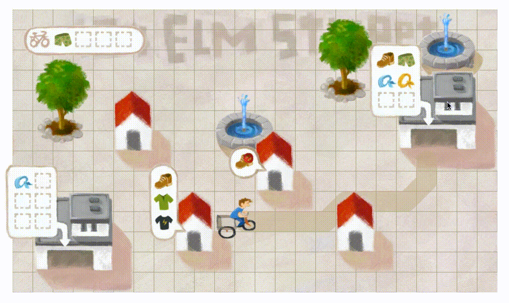

# 404 Elm Street

You can find a demo [here](http://zalando.github.io/elm-street-404/).

This project is not under consistent development, so if you file an issue or PR it might be a while before we get back to you. If you have an idea (and can be patient with us!), please make sure you hear back from a maintainer before starting any development. We will help you ensure that your ideas maintain a consistent game flow.

Read more about the game on the [Zalando Tech blog](https://tech.zalando.com/blog/using-elm-to-create-a-fun-game-in-just-five-days/).

You are Joe, the courier. It is your job, to deliver *all* the fashion to *all* the customers. Sometimes, you have to pick up stuff and return it to Zalando.

No problem.

However, customers keep ordering more and more — and your bicycle only has room for so many boxes...

To succeed, you'll have to plan your route carefully. You have to decide which packages to deliver in which order. And you really, really have to hurry. You'll find, that it's not as easy being a Zalandoer as you thought it was:

Unhappy customers: **you lose**.

## Instructions to run

1. Install elm [elm-lang.org/install](http://elm-lang.org/install)
2. Clone this repo and `cd` into it
3. Start `elm reactor`
4. Open `http://localhost:8000/src/Main.elm` in the browser to see the game

## Embedded mode

1. Run `elm make src/Main.elm --output elm.js`
2. Start `elm reactor`
3. Open `http://localhost:8000/index.html`
4. Alternatively there is `http://localhost:8000/embed.html` that demonstrates how the game may be toggled by a button
